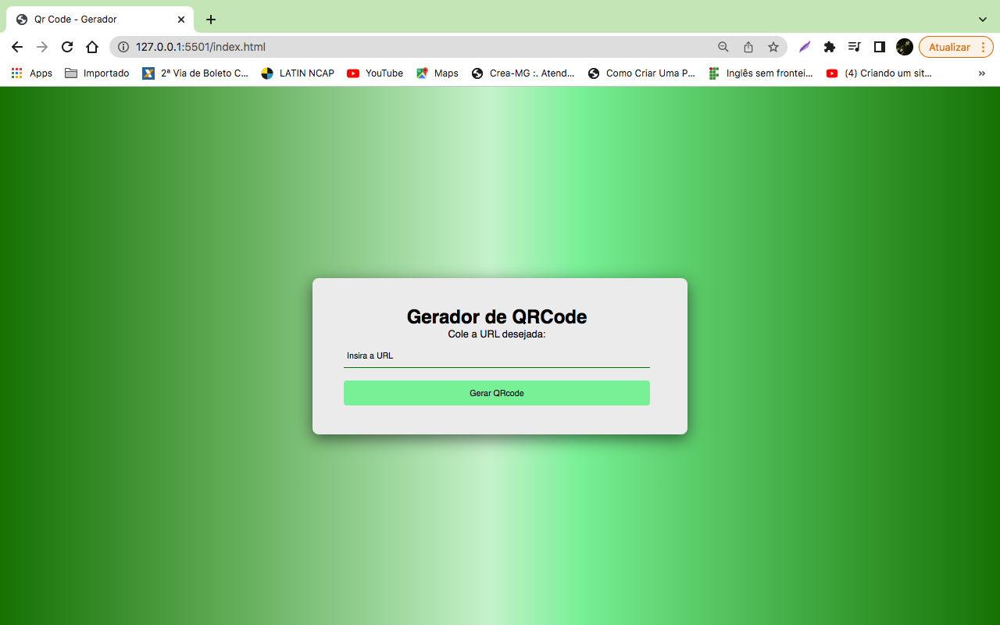
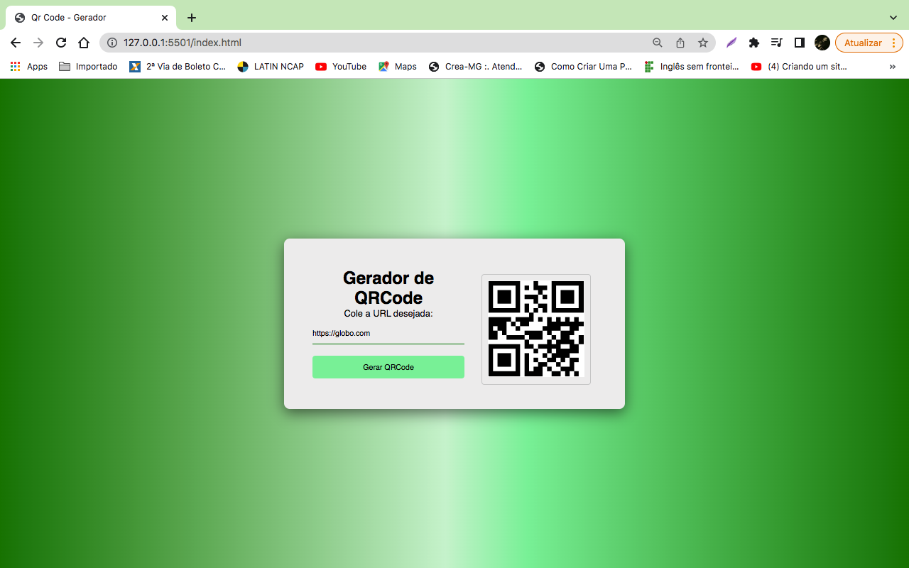

<p align="center">
  <a href="#-projeto">Projeto</a>&nbsp;&nbsp;&nbsp;|&nbsp;&nbsp;&nbsp;
  <a href="#-tecnologias">Tecnologias</a>&nbsp;&nbsp;&nbsp;|&nbsp;&nbsp;&nbsp;
  <a href="#-layout">Layout</a>&nbsp;&nbsp;&nbsp;|&nbsp;&nbsp;&nbsp;
</p>

<p align="center">
 

  
</p>


<h1>Gerador de QRCode.</h1>

# 💻 Projeto:
<p>Projeto básico para iniciantes. Utilizando o consumo de uma API para a realização deste projeto. </p>

## 🚀 Tecnologias:

Esse projeto foi desenvolvido usando as seguintes tecnologias:


 
   
## :wrench: Como Utilizar

Clone essa aplicação utilizando o [Git](https://git-scm.com) e utilizando os seguintes comandos:

```bash
# Clonando esse repositório
$ git clone https://github.com/chagasleandro/Gerador-QRCode
```
Em seguida execute o arquivo 'index.html' no seu navegador. </br>

## 🔖 Layout:
Você pode visualizar o layout do projeto através [desse link](https://chagasleandro.github.io/Gerador-QRCode/)
## Gerador de QRCode Tela inicial - Desktop

<p>Após inserir a URL será gerado um QRCode, e com um celular com câmera poderá fazer o acesso da URL.</p>


## API:
https://goqr.me/api/

## Gerador de Gradient e Box Shadow
https://www.cssmatic.com/box-shadow</br>
https://cssgradient.io/

## Google Fonts:
https://fonts.google.com/

Aprendendo a programar juntos!!
